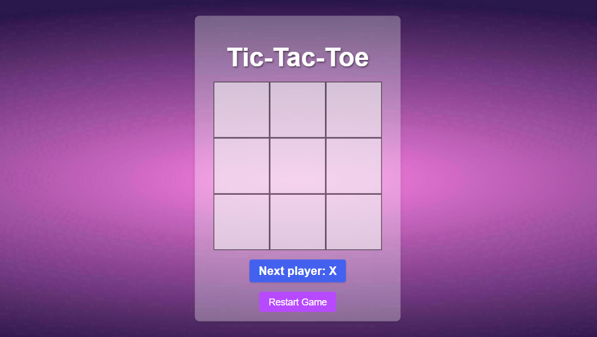

<h2 align="center">
  Tic-Tac-Toe Game - 
  <a href="https://tic-tac-toc-mridul.vercel.app/" target="_blank">Tic Tac Toe</a>  
  
Welcome to my Tic-Tac-Toe game!

</h2>

  

## Table of Contents

- [Introduction](#introduction)
- [Technologies Used](#technologies-used)
- [Features](#features)
- [License](#license)

## Introduction

This project is a simple yet fun Tic-Tac-Toe game built with React.js. Enjoy playing the game and explore the code to see how it's made!

## Technologies Used

This Tic-Tac-Toe game was built using the following technologies:
 
- React.js
- JavaScript
- CSS3
- HTML
- VsCode
- Vercel

## Features

- Responsive design
- Interactive gameplay
- Restart game functionality

